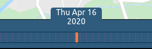
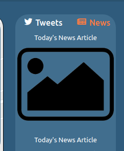
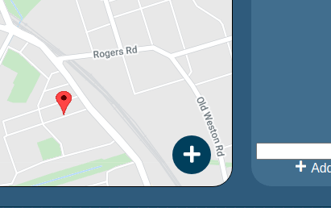
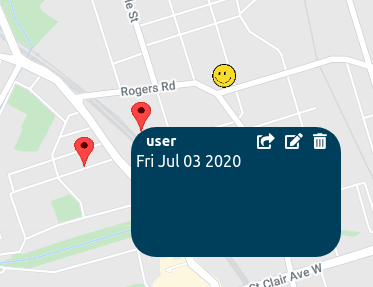
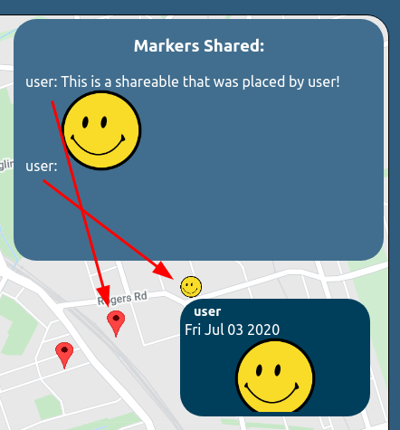

# Pandemic Diary
Welcome to our completed Pandemic Diary project! It unifies the work we did in Phase 1 (a create-react-app frontend) with the MongoDB+Express.js backend that was written in Phase 2. The website serves as a web application that enables users to have a visual diary of what they -- and others -- have been doing during the 2019-20?? COVID-19 pandemic, and what their plans are after when (or if...) it ends.

## Demo
A live instance of the site is running [here](https://morning-sands-10234.herokuapp.com/); there are some example user interactions already available. It may take a few seconds for the Heroku server to spin up.

### IMPORTANT! Hard-Coded Data
We have hardcoded data from **August 12-August 20** in the above live instance. If you visit other dates, you may not see much content.

Additionally, if you hover over any element, you will see a tooltip explaining how the app works. There is also a help button on the bottom right.

## Usage
The `package.json` files defines various scripts. Defined in the project root `package.json` file are server-related dependencies and it includes a `postinstall` script that also installs the client dependencies. In `client/package.json`, you'll see client-related dependencies.

The client (create-react-app, port 3000) can be run separately from the backend (MongoDB database, port 27017 & Express server, port 5000). This is useful if you want hot-reloading of the client for development. In production, the Express backend serves the built files. 
### Development
Features hot-reloading of the client and server files. Visit [localhost:3000](http://localhost:3000) to view the site with client hot-reloading, or [localhost:5000](http://localhost:5000) if you don't want it (this runs the static build created on `npm run client-build`/`npm start`).
```
npm install
npm run backend
npm run client
```
### Production Build
Features hot-reloading of the server files but NOT the client files. Visit [localhost:5000](http://localhost:5000) to view the Express-served static build created on `npm run client-build`/`npm start`. 
```
npm install
npm start
```
## Server Routes
See the README.md file in `./server`.

## Credentials & Permissions
Users may create their own accounts, or preview the website as guests. There are other accounts that can be experimented with to explore app functionality:
|Username|Password|
|--------|--------|
|admin|admin|
|user|user|
|user2|user2|
|user3|user3|

Users' changes persist among page refreshes as they are saved to the server; guests' interactions are more limited. Users can:
- Select the date they'd like to explore
- Share content with other users, and receive notifications of content they've received
- Move around on & place shareable-markers on the map
- Modify (edit and delete) shareable-markers they've placed
- Add a Tweet to the Tweets container
- View News articles

Administrators have permissions to, on top of the aforementioned:
- Delete users
- Modify all markers

## Features
Here are some examples of user interactions that are available:
- Collapsing side menus: you can click the collapse button on the side menus to collapse them so that the map is larger.
- Selecting a date to travel to: by clicking and dragging on the Timeline, you can see content specific to a certain day.


- Viewing News specific to a certain day


- Adding a marker (text or image) to the map: when hovering over the PopoutButton, some shareables will show up. Click them to enable the adding mode, and click somewhere on the to place the marker. A popup window will appear, allowing you to modify the contents of the marker you placed. 


- Categorizing markers: currently, we have certain groups you can place shareables in: news, vacation, and other. With this, you can describe the current state of affairs in the world or plan a vacation! Select from the filters on the left side to narrow down your search.

- Editing markers you've placed: currently, there is the option to share your marker, edit its contents, or delete it.


- When a marker is shared with another user (by clicking the share button and typing in the user's username), the other user will see the shareable pop up in their notifications box.


- When the admin is logged in, the "Info" box in the left menu panel contains an admin panel in which the administrator can view reported markers to moderate the content, or delete problematic users.
