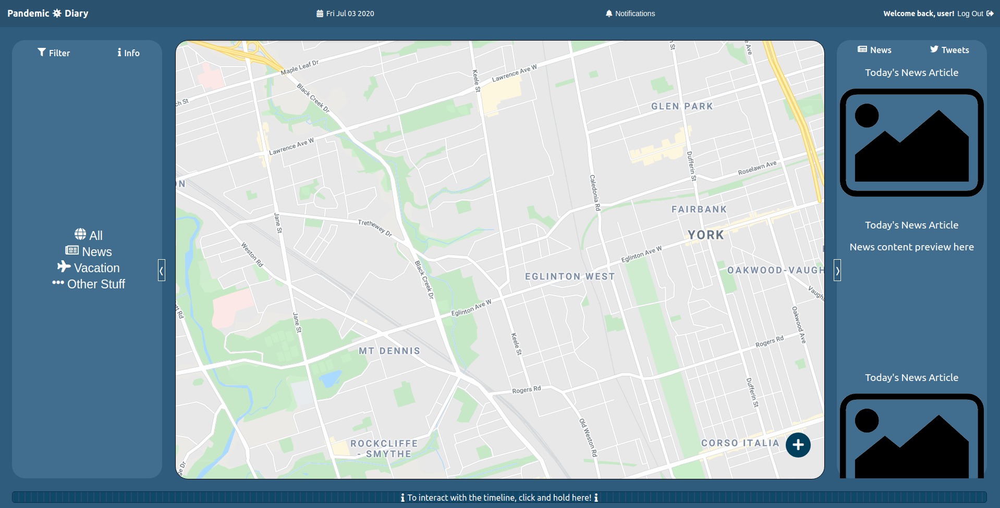

# Pandemic Diary
Welcome to the portion of the site we've completed for Phase 1 of the CSC309 group project! The frontend of the website is complete, with animations across views in the single page that makes up our app.



## Getting Started
To run the server:
```
$ git clone https://github.com/csc309-summer-2020/team01.git
$ cd team01
$ npm install
$ npm start
```
The website will automatically be opened in your default browser and you'll see the landing page. If you scroll down, you'll see some features & instructions. If you just want to enter the app, click `Enter Site`.

### Credentials & Permissions
For Phase 1, we've hardcoded it so that the user is automatically logged in as `user`. There are other accounts that can be experimented with to explore app functionality:
|Username|Password|
|--------|--------|
|admin|admin|
|user|user|
|user2|user2|

We would validate user logins and registrations server-side in Phase 2. 

Currently, users have permissions to:
- Select the date they'd like to explore
- Share content with other users, and receive notifications of content they've received
- Move around on & place shareable-markers on the map
- Modify (edit and delete) shareable-markers they've placed
- Add a Tweet to the Tweets container
- View News articles

Administrators have permissions to, on top of the aforementioned:
- Delete users
- Modify all markers

## Features
Here are some examples of user interactions that are available:
- Collapsing side menus: you can click the collapse button on the side menus to collapse them so that the map is larger.
- Selecting a date to travel to: by clicking and dragging on the Timeline, you can see content specific to a certain day.


- Viewing News specific to a certain day


- Adding a marker (text or image) to the map: when hovering over the PopoutButton, some shareables will show up. Click them to enable the adding mode, and click somewhere on the to place the marker. A popup window will appear, allowing you to modify the contents of the marker you placed. 


- Categorizing markers: currently, we have certain groups you can place shareables in: news, vacation, and other. With this, you can describe the current state of affairs in the world or plan a vacation! Select from the filters on the left side to narrow down your search.

- Editing markers you've placed: currently, there is the option to share your marker, edit its contents, or delete it.


- When a marker is shared with another user (by clicking the share button and typing in the user's username), the other user will see the shareable pop up in their notifications box.


- When the admin is logged in, the "Info" box in the left menu panel contains an admin panel in which the administrator can view reported markers to moderate the content, or delete problematic users.

## Content that has been hardcoded
Here is a list of the hardcoded data you can experiment with:

- News articles appear on the following dates:
    * Sat Jun 06 2020
    * Sun Jun 07 2020
    * The current day (whenever you are using the app)
- Tweets:
    * there are 3 Tweets that can be viewed, and you can add more.
# These are the main features. We hope you enjoy our app!
